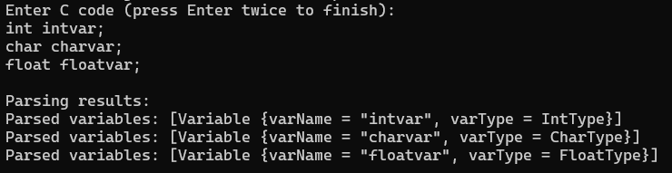

# 20CYS312 - Principles of Programming Languages
   <br/>
  

## Assignment - 02: Implementation of Language Parser using Haskell

- Date of Start: 
- Date of Submission:  
  
### Objective:
Design and implement a parser in Haskell for a programming language of your choice: _Python_, or _Java_. The parser should be able to analyze and process the syntax of the chosen language, identifying and extracting key elements such as variables, data types, expressions and control structures.  Your parser should be capable of handling a representative subset of the language's syntax.

#### Assignment Components:

- **Language Choice:** Select one of the following programming languages - _Python_, or _Java_.

- **Parser Implementation:** Develop a parser in Haskell that can analyze the syntax of the chosen language. The parser should be able to handle a significant subset of the language's features.

- **Syntax Elements:** The parser should be capable of recognizing and processing key syntax elements:
  - **D1:** Variables and data types
  - **D2:** Declarations and assignments
  - **D3:** Control structures (e.g., if statements, loops)
  - Error Handling: Implement appropriate error handling mechanisms to deal with syntax errors in the input code.

- **Documentation:** Provide clear documentation for your Haskell parser, including instructions on how to run it and examples of valid and invalid input code.

- **Testing:** Develop a set of test cases to validate the correctness and effectiveness of your parser. Include test cases that cover various aspects of the chosen language's syntax.

- **Report:** Write a comprehensive report discussing the design decisions, challenges faced, and lessons learned during the implementation of the parser. Include sample input code snippets and corresponding parser outputs in your report.

#### Submission Guidelines:

- Submit your Haskell source code along with any necessary files for running the parser.
- Include a README file with instructions on how to compile and run your parser.
- Submit the report in a separate document (PDF or Markdown).
- _Note:_ While you are encouraged to explore additional features and improvements beyond the basic requirements, make sure to prioritize the core functionality of parsing the chosen language's syntax.

#### Reference Code
This reference code is only to give you an idea on how to start. 
```
import Text.Parsec
import Text.Parsec.String (Parser)
import Control.Monad (forM_) -- Using forM_ from Control.Monad

-- Data types for representing variable declarations
data Type = IntType | FloatType | CharType deriving (Show)
data Variable = Variable { varName :: String, varType :: Type } deriving (Show)

-- Parsec parser for variable declarations
variableParser :: Parser [Variable]
variableParser = sepBy1 singleVariable (char ',')

-- Parse a single variable declaration
singleVariable :: Parser Variable
singleVariable = do
    varType <- parseType  -- Parsing variable type
    spaces                -- Parsing spaces between type and variable name
    varName <- identifier  -- Parsing variable name
    return $ Variable varName varType  -- Constructing Variable object

-- Parsec parser for variable types
parseType :: Parser Type
parseType = try (string "int" >> return IntType)  -- Parsing 'int'
        <|> try (string "float" >> return FloatType)  -- Parsing 'float'
        <|> (string "char" >> return CharType)  -- Parsing 'char'

-- Parsec parser for identifiers (variable names)
identifier :: Parser String
identifier = many1 letter  -- Parsing variable names

-- Parse a single line of input and print the result
parseLine :: String -> IO ()
parseLine line =
    case parse variableParser "" line of  -- Parsing the line using variableParser
        Left err -> putStrLn $ "Error in line '" ++ line ++ "': " ++ show err  -- Handling parsing errors
        Right vars -> putStrLn $ "Parsed variables: " ++ show vars  -- Printing parsed variables

-- Read input from multiple lines and parse each line
main :: IO ()
main = do
    putStrLn "Enter C code (press Enter twice to finish):"  -- Prompting user for input
    input <- getLinesUntilEmpty  -- Reading lines until an empty line is encountered
    putStrLn "Parsing results:"  -- Printing parsing results header
    forM_ input parseLine  -- Applying parseLine to each line of input using forM_

-- Read lines of input until an empty line is encountered
getLinesUntilEmpty :: IO [String]
getLinesUntilEmpty = do
    line <- getLine  -- Reading a line of input
    if null line  -- Checking if the line is empty
        then return []  -- Returning an empty list if line is empty
        else do
            rest <- getLinesUntilEmpty  -- Recursively reading more lines
            return (line : rest)  -- Returning the current line and the rest

```
<p align="center">

</p>
